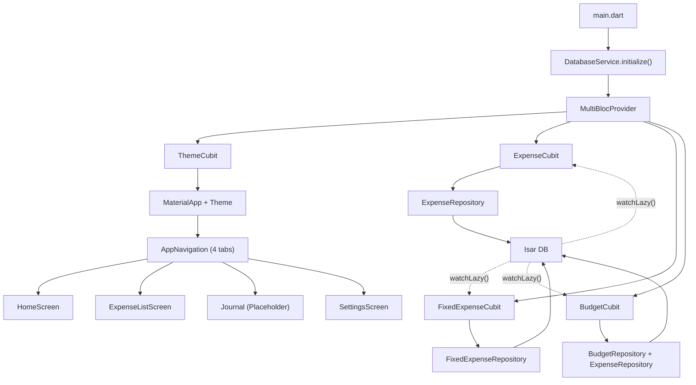

# 🔍 MoneJour — Báo Cáo Kiểm Toán Toàn Diện

> **Ngày kiểm toán:** 2026-05-08  
> **Phiên bản:** v1.0.0 (MVP)  
> **Phạm vi:** Toàn bộ codebase Flutter (`mone_jour/lib/`)  
> **Tổng file source:** 36 files (~3,500+ dòng code, không tính generated)

---

## 1. Tổng Quan Kiến Trúc

### Cấu Trúc Thư Mục (Tree)

```
mone_jour/lib/
├── main.dart                          ✅ Entry point + MultiBlocProvider
├── core/
│   ├── constants/categories.dart      ✅ 9 danh mục + lookup
│   ├── theme/app_theme.dart           ✅ Light + Dark (366 dòng)
│   └── utils/                         ✅ 4 utility files
├── data/
│   ├── models/         (4 files)      ✅ Isar Collections
│   └── repositories/   (4 files)      ✅ Repository Pattern
├── logic/
│   ├── expense/        (2 files)      ✅ Cubit + Sealed State
│   ├── budget/         (2 files)      ✅ Cubit + Sealed State
│   ├── fixed_expense/  (2 files)      ✅ Cubit + Sealed State
│   ├── theme/          (1 file)       ✅ ThemeCubit
│   ├── journal/                       ❌ TRỐNG
│   ├── stats/                         ❌ TRỐNG
│   └── settings/                      ❌ TRỐNG
├── services/
│   └── database_service.dart          ✅ Isar Singleton
└── ui/
    ├── navigation/app_navigation.dart ✅ IndexedStack 4 tab
    ├── screens/
    │   ├── home/home_screen.dart       ⚠️ 975 dòng — BLOATED
    │   ├── expense/                    ✅ 2 screens
    │   ├── journal/                    ❌ TRỐNG
    │   ├── stats/                      ❌ TRỐNG
    │   └── settings/                   ✅ 1 screen
    └── widgets/                        ✅ 6 widgets (1 dead code)
```

### Tech Stack

| Tầng | Công nghệ | Phiên bản | Trạng thái |
|------|-----------|-----------|-----------|
| Framework | Flutter / Dart | ≥3.19 / ≥3.3 | ✅ Cập nhật |
| Database | Isar (NoSQL) | ^3.1.0+1 | ✅ Ổn định |
| State Mgmt | flutter_bloc (Cubit) | ^9.0.0 | ✅ Tốt |
| Charts | fl_chart | ^0.69.0 | ⚠️ Chưa sử dụng |
| Format | intl | ^0.20.2 | ✅ Hoạt động |
| Utilities | path_provider, uuid, shared_prefs | latest | ⚠️ uuid chưa sử dụng |
| Equality | equatable | ^2.0.7 | ✅ Tốt |

### Luồng Hoạt Động Chính



---

## 2. Phân Tích Từng Tầng

### 2.1 Data Layer (Models + Repositories)

| File | Chức năng | Trạng thái | Ghi chú |
|------|-----------|-----------|---------|
| `expense.dart` | Model chi tiêu/thu nhập | ✅ Tốt | Index đúng, rõ ràng |
| `journal_entry.dart` | Model nhật ký | ✅ Tốt | Sẵn sàng, chỉ cần Cubit |
| `budget.dart` | Model hạn mức | ✅ Tốt | Composite index đúng |
| `fixed_expense.dart` | Model template | ✅ Tốt | Tách biệt đúng với Expense |
| `expense_repository.dart` | CRUD + thống kê | ✅ Tốt | 7 methods đầy đủ |
| `journal_repository.dart` | CRUD + filter | ✅ Tốt | Sẵn sàng cho Cubit |
| `budget_repository.dart` | Upsert + query | ✅ Tốt | Logic upsert sạch |
| `fixed_expense_repository.dart` | CRUD + execute | ✅ Tốt | Clone template → Expense |

> [!TIP]
> **Nhận xét tốt:** Repository pattern được áp dụng đúng chuẩn — tách biệt database logic khỏi Cubit, dễ mock cho testing. Comment giải thích tư duy rất rõ ràng.

### 2.2 Logic Layer (Cubits + States)

| File | Chức năng | Trạng thái | Ghi chú |
|------|-----------|-----------|---------|
| `expense_cubit.dart` | Quản lý state chi tiêu | ✅ Tốt | Reactive, watcher, carriedOverBalance |
| `expense_state.dart` | Sealed states | ✅ Tốt | Loading/Loaded/Error pattern |
| `budget_cubit.dart` | Quản lý hạn mức | ✅ Tốt | Dual watcher (expense + budget) |
| `budget_state.dart` | BudgetProgress | ✅ Tốt | Enum status + ratio/remaining |
| `fixed_expense_cubit.dart` | CRUD template | ✅ Tốt | Auto-refresh qua watcher |
| `fixed_expense_state.dart` | Sealed states | ✅ Tốt | Đơn giản, đúng mẫu |
| `theme_cubit.dart` | Dark/Light toggle | ✅ Tốt | SharedPreferences persist |

> [!WARNING]
> **Thiếu 3 Cubits quan trọng:**
> - `journal/` — Thư mục trống, chưa có JournalCubit
> - `stats/` — Thư mục trống, chưa có StatsCubit
> - `settings/` — Thư mục trống (hiện dùng ThemeCubit trực tiếp)

### 2.3 UI Layer (Screens + Widgets)

| File | Dòng code | Trạng thái | Ghi chú |
|------|-----------|-----------|---------|
| `home_screen.dart` | **975** | 🔴 Bloated | Cần refactor cấp bách |
| `expense_list_screen.dart` | 211 | ✅ Tốt | CustomScrollView, month selector |
| `add_expense_screen.dart` | 312 | ✅ Tốt | Form validation đúng |
| `settings_screen.dart` | 76 | ✅ Tốt | Đơn giản |
| `app_navigation.dart` | 126 | ✅ Tốt | Placeholder cho journal |
| `summary_card.dart` | 143 | ✅ Tốt | Theme-aware |
| `budget_progress_card.dart` | 160 | ✅ Tốt | Status color system |
| `fixed_expense_card.dart` | 96 | 🔴 Bug | Hardcode `Colors.white` |
| `grouped_transaction_list.dart` | 270 | ✅ Tốt | Group by date, empty state |
| `expense_card.dart` | 111 | 🟡 Dead code | Không sử dụng ở đâu |
| `category_picker.dart` | 73 | ✅ Tốt | Wrap + ChoiceChip |

---

## 3. Ma Trận Lỗi Tiềm Ẩn (Bug Matrix)

| # | Mức độ | File | Vấn đề | Tác động |
|---|--------|------|--------|---------|
| 1 | 🔴 CRITICAL | `fixed_expense_card.dart:31` | Hardcode `Colors.white` cho Material color | Dark Mode → text/icon vô hình trên nền trắng |
| 2 | 🔴 CRITICAL | `home_screen.dart` | 975 dòng, chứa 7 dialog/sheet functions | Không bảo trì được, vi phạm SRP nghiêm trọng |
| 3 | 🟠 HIGH | `home_screen.dart:118-119` | `onTap` và `onLongPress` cùng gọi `_confirmDelete` | UX kém — tap vào giao dịch mà không edit được, chỉ xóa |
| 4 | 🟠 HIGH | `expense_list_screen.dart:131-132` | Cùng vấn đề — tap + longpress đều delete | Thiếu chức năng Edit Expense |
| 5 | 🟠 HIGH | `expense_card.dart` | 111 dòng dead code | Tăng kích thước bundle vô ích, gây nhầm lẫn |
| 6 | 🟡 MEDIUM | `pubspec.yaml` | `uuid: ^4.5.1` và `fl_chart: ^0.69.0` khai báo nhưng chưa dùng | Tăng thời gian build + kích thước app thừa |
| 7 | 🟡 MEDIUM | `home_screen.dart` + `expense_list_screen.dart` | `_confirmDelete()` bị duplicate code (giống nhau gần 100%) | Vi phạm DRY — nên extract thành shared utility |
| 8 | 🟡 MEDIUM | `expense_cubit.dart:44` | `DateTime(2000)` hardcode để tính carried balance | Giả định không ai dùng app trước năm 2000 — nên dùng epoch |
| 9 | 🟡 MEDIUM | `main.dart:24-27` | `FlutterError.onError` dùng `print()` | Production không nên dùng print, cần logging framework |
| 10 | 🟡 MEDIUM | `app_theme.dart` | `minimalistLight` và `minimalistDark` có code rất giống nhau (~150 dòng duplicate) | Nên extract common theme thay vì copy-paste |
| 11 | 🔵 LOW | `currency_input_formatter.dart:21` | Regex `r'[^\\d]'` có thể escape sai | Nên dùng raw string `r'[^\d]'` (2 backslash issue) |
| 12 | 🔵 LOW | Navigation 4 tabs | Tab "Nhật ký" là placeholder, tab "Thống kê" không tồn tại | Chưa đủ MVP |
| 13 | 🔵 LOW | `expense_cubit.dart` | `updateExpense` method tồn tại nhưng chưa có UI gọi | Dead method — sẵn sàng nhưng chưa kết nối |
| 14 | 🔵 LOW | `test/widget_test.dart` | Test file rỗng — 0 test case | Không có kiểm thử tự động |

---

## 4. Chi Tiết Lỗi & Khắc Phục

### 🔴 #1: Dark Mode bug — `FixedExpenseCard` hardcode `Colors.white`

**File:** `lib/ui/widgets/fixed_expense_card.dart` (dòng 31)

**Tác động:** Khi bật Dark Mode, card chi tiêu cố định vẫn hiển thị nền trắng → không hòa hợp với theme tối, tạo hiệu ứng lạ mắt.

**Code lỗi:**
```dart
// ❌ Dòng 31: Hardcode màu trắng
color: Colors.white,
```

**Code sửa:**
```dart
// ✅ Dùng theme-aware color
color: Theme.of(context).colorScheme.surface,
```

---

### 🔴 #2: `home_screen.dart` — 975 dòng vi phạm SRP

**File:** `lib/ui/screens/home/home_screen.dart`

**Tác động:** File này chứa **1 widget chính + 1 StatefulWidget phụ (_TemplateSheet) + 7 hàm dialog/sheet**. Rất khó maintain, debug và test.

**Đề xuất tách:**

| Hàm/Widget hiện tại | Tách ra file mới |
|---------------------|-----------------|
| `_showSetBudgetDialog()` | `widgets/dialogs/budget_dialog.dart` |
| `_showConfirmDialog()` | `widgets/dialogs/confirm_payment_dialog.dart` |
| `_showTemplateOptionsDialog()` | `widgets/dialogs/template_options_sheet.dart` |
| `_confirmDeleteTemplate()` | `widgets/dialogs/confirm_delete_dialog.dart` |
| `_confirmDelete()` | `widgets/dialogs/confirm_delete_dialog.dart` (shared) |
| `_TemplateSheet` class | `widgets/sheets/template_sheet.dart` |
| `_showTemplateSheet()` | Kèm theo TemplateSheet |
| `_buildFixedExpenseSection()` | `widgets/sections/fixed_expense_section.dart` |
| `_buildBudgetSection()` | `widgets/sections/budget_section.dart` |

> Sau khi tách, `home_screen.dart` sẽ còn ~130-150 dòng (chỉ layout chính + BlocBuilder).

---

### 🟠 #3 & #4: Tap giao dịch = Delete thay vì Edit

**File:** `home_screen.dart:118-119` và `expense_list_screen.dart:131-132`

**Tác động:** Người dùng tap vào giao dịch → dialog xóa. Đây là UX rất tệ vì:
- Kỳ vọng của người dùng khi tap = xem chi tiết hoặc chỉnh sửa
- Long press = hành động phụ (xóa/options)
- Cả 2 hành động đều chỉ xóa → thiếu Edit Expense hoàn toàn

**Đề xuất:**
```dart
// ✅ onTap → Mở edit screen
onTap: (expense) => _openEditScreen(context, expense),
// ✅ onLongPress → Hiện bottom sheet options (Sửa / Xóa)
onLongPress: (expense) => _showExpenseOptions(context, expense),
```

---

### 🟡 #6: Dependencies thừa trong pubspec.yaml

**Code sửa:**
```yaml
# Nếu chưa cần → comment hoặc xóa để giảm build time
# uuid: ^4.5.1      # Chưa sử dụng
# fl_chart: ^0.69.0  # Sẽ dùng khi làm Stats Screen → giữ lại nếu sắp implement
```

---

### 🟡 #7: Duplicate `_confirmDelete()` code

Hàm `_confirmDelete()` ở `home_screen.dart` và `expense_list_screen.dart` gần giống 100%.

**Đề xuất:** Extract thành shared function:
```dart
// lib/ui/widgets/dialogs/confirm_delete_expense.dart
void showDeleteExpenseDialog(BuildContext context, Expense expense) {
  showDialog(
    context: context,
    builder: (dialogContext) => AlertDialog(
      title: const Text('Xóa giao dịch?'),
      content: const Text('Bạn có chắc muốn xóa?'),
      actions: [
        TextButton(onPressed: () => Navigator.pop(dialogContext), child: const Text('Hủy')),
        FilledButton(
          onPressed: () {
            context.read<ExpenseCubit>().deleteExpense(expense.id);
            Navigator.pop(dialogContext);
          },
          style: FilledButton.styleFrom(backgroundColor: AppTheme.expenseRed),
          child: const Text('Xóa'),
        ),
      ],
    ),
  );
}
```

---

## 5. Đánh Giá Bảo Mật & Checklist

### OWASP Mobile Checklist (Áp dụng cho app offline)

| Tiêu chí | Trạng thái | Ghi chú |
|-----------|-----------|---------|
| Không hardcode secrets | ✅ Passed | Không có API key hay token |
| Dữ liệu lưu local an toàn | ✅ Passed | Isar mã hóa mặc định |
| Không gọi network | ✅ Passed | 100% offline |
| Input validation | ⚠️ Partial | Validate số tiền > 0, nhưng không giới hạn max amount |
| Error handling | ✅ Tốt | try-catch ở tất cả Cubits |
| Sensitive data in logs | ⚠️ | `print()` trong FlutterError handler có thể in số tiền |

### Điểm mạnh của dự án

1. **Kiến trúc phân tầng rõ ràng:** Data → Logic → UI tách biệt chuẩn
2. **Reactive system:** Isar watcher → Cubit auto-reload → UI tự động cập nhật
3. **Sealed class state:** Type-safe, compiler bắt lỗi tại build-time
4. **Repository pattern:** Dễ swap DB engine, dễ mock test
5. **Theme system:** Hỗ trợ Dark/Light, persist SharedPreferences
6. **Comment tiếng Việt cực tốt:** Giải thích "tại sao" chứ không chỉ "cái gì"

---

## 6. Lộ Trình Khắc Phục (Roadmap)

### Phase 1: 🚨 Hotfix ngay (1-2 ngày)

| # | Task | Ưu tiên | Ước lượng |
|---|------|---------|----------|
| 1 | Fix `FixedExpenseCard` hardcode `Colors.white` → dùng theme color | 🔴 Critical | 5 phút |
| 2 | Xóa `expense_card.dart` (dead code) | 🟠 High | 2 phút |
| 3 | Fix `onTap` trên giao dịch → tách tap (detail) vs longpress (options) | 🟠 High | 30 phút |
| 4 | Comment/remove `uuid` dependency chưa dùng | 🟡 Medium | 2 phút |

### Phase 2: 🔧 Refactor (3-5 ngày)

| # | Task | Ưu tiên | Ước lượng |
|---|------|---------|----------|
| 5 | Tách `home_screen.dart` → 6-8 files nhỏ | 🔴 Critical | 2-3 giờ |
| 6 | Extract duplicate `_confirmDelete()` thành shared | 🟡 Medium | 30 phút |
| 7 | Thêm Edit Expense Screen (tái sử dụng AddExpenseScreen) | 🟠 High | 1-2 giờ |
| 8 | Replace `print()` error handler bằng logging framework | 🟡 Medium | 30 phút |
| 9 | Giảm duplicate trong `app_theme.dart` (extract common) | 🔵 Low | 1 giờ |

### Phase 3: ✨ Hoàn thiện MVP (5-7 ngày)

| # | Task | Ưu tiên | Ước lượng |
|---|------|---------|----------|
| 10 | JournalCubit + JournalScreen (CRUD + mood picker) | 🟠 High | 4-6 giờ |
| 11 | StatsCubit + StatsScreen (pie chart, bar chart với fl_chart) | 🟠 High | 4-6 giờ |
| 12 | Unit tests cho Repositories + Cubits | 🟡 Medium | 4-6 giờ |
| 13 | Widget tests cho các screen chính | 🔵 Low | 2-3 giờ |

### Phase 4: 🚀 Production Ready

| # | Task | Ưu tiên | Ước lượng |
|---|------|---------|----------|
| 14 | Performance profiling (IndexedStack + large lists) | 🟡 Medium | 2 giờ |
| 15 | App icon + splash screen | 🟡 Medium | 1 giờ |
| 16 | Export/backup data (JSON/CSV) | 🔵 Low | 3-4 giờ |
| 17 | Localization (vi/en) hoàn chỉnh | 🔵 Low | 2-3 giờ |

---

## 7. Tổng Kết Điểm Đánh Giá

| Tiêu chí | Điểm | Nhận xét |
|----------|------|---------|
| **Kiến trúc** | 8/10 | Phân tầng rõ ràng, chỉ thiếu tách file bloated |
| **Code quality** | 7/10 | Comment tốt, naming chuẩn, nhưng có duplicate + dead code |
| **State management** | 9/10 | Sealed class + Isar watcher pattern rất tốt |
| **UI/UX** | 6/10 | Theme tốt nhưng tap = delete là UX tệ |
| **Testing** | 1/10 | Gần như 0 test |
| **Bảo mật** | 9/10 | Offline-first, không có attack surface |
| **Hoàn thiện MVP** | 6.5/10 | ~65% done, thiếu Journal + Stats + Edit |

> **Tổng:** Codebase có nền tảng kiến trúc **tốt**, comment giải thích tư duy **xuất sắc**, reactive pattern **chuẩn**. Vấn đề chính là `home_screen.dart` quá lớn, thiếu Edit Expense, và 3 module trống (Journal, Stats, Settings cubit). Fix các bug Critical + Refactor Phase 1-2 sẽ nâng chất lượng đáng kể.
