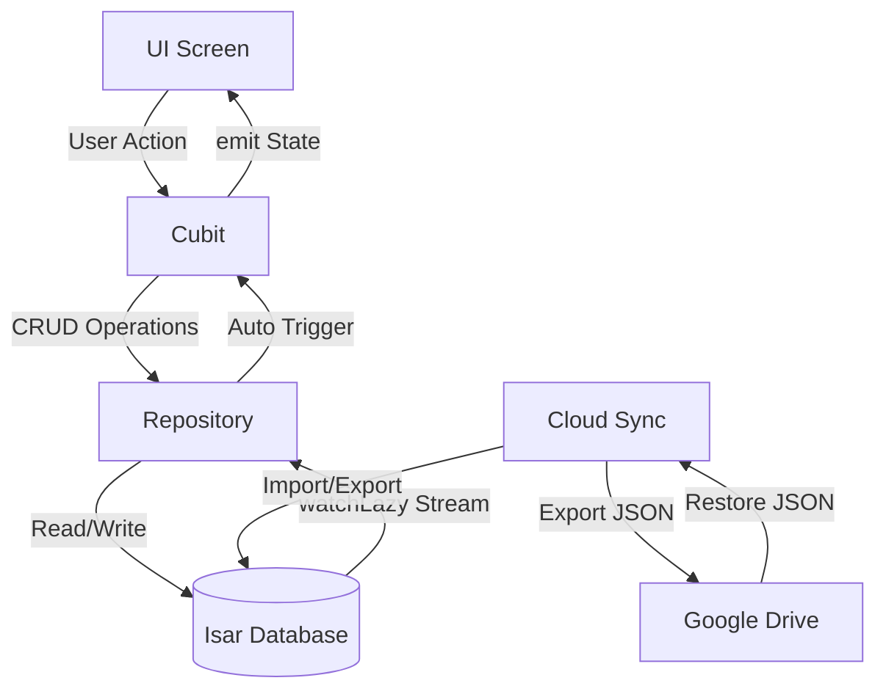

# 📋 PROJECT_CONTEXT — MoneJour (Giản Ký)

> **Cập nhật lần cuối:** 2026-05-17
> **Phiên bản:** 1.0.0+1
> **Trạng thái:** MVP hoàn thiện — Sẵn sàng production

---

## 1. Tổng Quan Dự Án

**MoneJour (Giản Ký)** là ứng dụng **quản lý chi tiêu cá nhân + ghi chú nhật ký** dành cho người Việt, xây dựng bằng Flutter theo kiến trúc **Offline-first** (100% hoạt động không cần internet).

### Đặc điểm cốt lõi
- 🔒 **Offline-first**: Mọi dữ liệu lưu local bằng Isar NoSQL Database
- 📊 **Quản lý chi tiêu**: Thu/Chi, Ngân sách theo danh mục, Chi tiêu cố định (template)
- 📝 **Nhật ký cá nhân**: Ghi chú tự do
- ☁️ **Cloud Sync tùy chọn**: Backup/Restore qua Google Drive (appDataFolder)
- 🔐 **Bảo mật**: PIN code + Biometric + Câu hỏi bảo mật
- 🌙 **Dark Mode**: Hỗ trợ Light/Dark theme
- 🇻🇳 **Tiếng Việt**: Locale vi_VN, format tiền VND

---

## 2. Tech Stack

| Tầng | Công nghệ | Phiên bản |
|------|-----------|-----------|
| **Framework** | Flutter | ≥3.19.0 |
| **Ngôn ngữ** | Dart | ≥3.3.0 <4.0.0 |
| **Database** | Isar (NoSQL) | ^3.1.0+1 |
| **State Management** | flutter_bloc (Cubit) | ^9.0.0 |
| **Charts** | fl_chart | ^0.69.0 |
| **Cloud Sync** | Google Drive API (googleapis) | ^16.0.0 |
| **Auth** | google_sign_in | ^6.2.2 |
| **Export** | archive (ZIP), share_plus | ^4.0.9, ^10.0.0 |
| **Import** | file_picker | ^8.1.4 |
| **Biometric** | local_auth | ^3.0.1 |
| **Animation** | lottie | ^3.3.3 |
| **Locale** | intl, flutter_localizations | ^0.20.2 |
| **Preferences** | shared_preferences | ^2.5.5 |

---

## 3. Kiến Trúc Hệ Thống

```
mone_jour/lib/
├── main.dart                          # Entry point — khởi tạo DB, locale, BlocProviders
├── core/
│   ├── constants/
│   │   └── categories.dart            # 9 danh mục chi tiêu mặc định
│   ├── theme/
│   │   └── app_theme.dart             # Material 3 theme (Light/Dark) — Palette Blue Pastel
│   └── utils/
│       ├── currency_formatter.dart    # formatVND() — 1500000 → "1.500.000 ₫"
│       ├── currency_input_formatter.dart # TextInputFormatter auto format hàng nghìn
│       ├── date_formatter.dart        # Format ngày kiểu VN
│       └── expense_grouper.dart       # Gom nhóm giao dịch theo ngày
├── data/
│   ├── models/                        # Isar @collection
│   │   ├── expense.dart               # Giao dịch thu/chi (7 fields)
│   │   ├── budget.dart                # Hạn mức theo danh mục/tháng
│   │   ├── fixed_expense.dart         # Template chi tiêu cố định
│   │   └── journal.dart               # Ghi chú cá nhân
│   └── repositories/                  # Repository pattern — tách DB logic
│       ├── expense_repository.dart    # CRUD + query + thống kê
│       ├── budget_repository.dart     # Upsert + query theo tháng
│       ├── fixed_expense_repository.dart # CRUD + execute (clone → Expense)
│       └── journal_repository.dart    # CRUD cơ bản
├── logic/                             # Cubit (State Management)
│   ├── expense/                       # ExpenseCubit + ExpenseState (sealed class)
│   ├── budget/                        # BudgetCubit + BudgetState + BudgetProgress
│   ├── fixed_expense/                 # FixedExpenseCubit + FixedExpenseState
│   ├── journal/                       # JournalCubit + JournalState
│   ├── stats/                         # StatsCubit + StatsState (Month/Year/Custom)
│   ├── theme/                         # ThemeCubit (Light/Dark toggle)
│   ├── settings/                      # SettingsCubit + SettingsState (PIN, Biometric)
│   └── cloud_sync/                    # CloudSyncCubit (Google Drive backup/restore)
├── services/
│   ├── database_service.dart          # Singleton Isar instance
│   ├── cloud_sync_service.dart        # Google Sign-In + Drive API wrapper
│   ├── export_service.dart            # Export JSON + CSV ZIP
│   └── import_service.dart            # Import JSON + CSV ZIP
└── ui/
    ├── navigation/
    │   └── app_navigation.dart        # Bottom Nav (4 tab) + Tutorial dialog
    ├── screens/
    │   ├── splash/splash_screen.dart  # Lottie animation → AuthWrapper
    │   ├── auth/
    │   │   ├── auth_wrapper.dart       # Auto-lock khi app paused
    │   │   └── pin_screen.dart         # PIN verify/setup + Biometric + Câu hỏi bảo mật
    │   ├── home/
    │   │   ├── home_screen.dart        # Dashboard: Summary + Budget + Fixed Expense + Stats
    │   │   └── widgets/
    │   │       ├── budget_dialog.dart
    │   │       ├── fixed_expense_actions_sheet.dart
    │   │       └── template_sheet.dart
    │   ├── expense/
    │   │   ├── expense_list_screen.dart # Danh sách giao dịch + tìm kiếm/lọc
    │   │   └── add_expense_screen.dart  # Form thêm/sửa giao dịch
    │   ├── journal/
    │   │   ├── journal_screen.dart     # Danh sách ghi chú
    │   │   └── note_editor_screen.dart # Trình soạn thảo ghi chú
    │   ├── stats/stats_screen.dart     # Biểu đồ tròn/cột + lọc Tháng/Năm/Tùy chọn
    │   └── settings/settings_screen.dart # Cài đặt toàn diện
    └── widgets/                        # Shared widgets
        ├── animated_slide_down.dart
        ├── budget_progress_card.dart
        ├── category_picker.dart
        ├── expense_action_sheet.dart
        ├── filter_transaction_sheet.dart
        ├── fixed_expense_card.dart
        ├── grouped_transaction_list.dart
        ├── summary_card.dart
        └── tutorial_dialog.dart
```

---

## 4. Luồng Dữ Liệu (Data Flow)



**Pattern chung của các Cubit:**
1. **Constructor** → Subscribe vào `repository.watchChanges()` (Isar stream)
2. **User Action** → Gọi repository method → Isar ghi data
3. **Isar Watcher** → Tự động trigger `_reload()` → emit state mới
4. **UI** → `BlocBuilder` nhận state → rebuild tự động

---

## 5. Danh Mục Chi Tiêu Mặc Định (9 danh mục)

| ID | Tên | Icon | Dùng cho |
|----|-----|------|----------|
| `food` | Ăn uống | 🍽️ restaurant | Chi tiêu |
| `transport` | Di chuyển | 🚗 directions_car | Chi tiêu |
| `shopping` | Mua sắm | 🛍️ shopping_bag | Chi tiêu |
| `entertainment` | Giải trí | 🎬 movie | Chi tiêu |
| `bills` | Hóa đơn | 🧾 receipt_long | Chi tiêu |
| `health` | Sức khỏe | ❤️ favorite | Chi tiêu |
| `education` | Học tập | 🎓 school | Chi tiêu |
| `income` | Thu nhập | 💰 account_balance_wallet | Thu nhập |
| `other` | Khác | ⋯ more_horiz | Cả hai |

---

## 6. Tính Năng Chi Tiết & Trạng Thái

### ✅ Đã Hoàn Thiện (Production Ready)

| # | Module | Mô tả |
|---|--------|-------|
| 1 | **Chi tiêu/Thu nhập** | Thêm/Sửa/Xóa giao dịch, phân loại theo 9 danh mục |
| 2 | **Số dư lũy kế** | Tính balance = Dư đầu kỳ + Thu nhập - Chi tiêu |
| 3 | **Ngân sách (Budget)** | Set hạn mức theo danh mục/tháng, cảnh báo 80%/100% |
| 4 | **Chi tiêu cố định** | Template 1-chạm → clone thành giao dịch thật |
| 5 | **Nhật ký (Journal)** | CRUD ghi chú cá nhân |
| 6 | **Thống kê (Stats)** | Biểu đồ tròn/cột, lọc theo Tháng/Năm/Khoảng tùy chỉnh |
| 7 | **Export/Import** | JSON đơn file + CSV ZIP (4 file) |
| 8 | **Cloud Sync** | Google Drive appDataFolder — backup/restore JSON |
| 9 | **Bảo mật** | PIN 4 số + Biometric + Câu hỏi bảo mật + Auto-lock |
| 10 | **Theme** | Light/Dark mode toggle |
| 11 | **Splash** | Lottie animation (Cat Paw Loading) |
| 12 | **Tutorial** | Dialog hướng dẫn lần đầu mở app |
| 13 | **Tìm kiếm/Lọc** | Filter giao dịch theo note, amount range, category |

---

## 7. Đánh Giá Kiến Trúc

### 🟢 Điểm Mạnh

| Tiêu chí | Đánh giá |
|----------|----------|
| **Separation of Concerns** | Rõ ràng: Model → Repository → Cubit → UI |
| **Repository Pattern** | Tách biệt DB logic khỏi business logic |
| **Sealed Class cho State** | Type-safe, compiler bắt buộc xử lý tất cả cases |
| **Isar Watcher** | Auto-refresh UI khi data thay đổi, không cần manual emit |
| **Singleton DB** | Đảm bảo 1 kết nối Isar duy nhất |
| **Comment tiếng Việt** | Giải thích rõ "tại sao", không chỉ "cái gì" |
| **Error Handling** | Có try-catch ở hầu hết các cubit và service |
| **Dark Mode** | Dùng `_buildTheme()` chung, giảm duplicate |
| **Auth Wrapper** | Xử lý tốt lifecycle (pause/resume) + cờ pauseLock |

### 🟡 Điểm Cần Cải Thiện

| # | Vấn đề | Mức độ | Giải thích |
|---|--------|--------|------------|
| 1 | **PIN lưu plaintext** trong SharedPreferences | 🔴 **Critical** | `pinCode` lưu trực tiếp dạng chuỗi, không hash. Nên dùng `flutter_secure_storage` + bcrypt/SHA-256 |
| 2 | **Câu hỏi bảo mật lưu plaintext** | 🔴 **Critical** | `securityAnswer` cũng lưu SharedPreferences không mã hóa |
| 3 | **Không có unit test** | 🟡 **Warning** | Chỉ có file `widget_test.dart` mặc định, 0 test thực tế |
| 4 | **File animation trùng lặp** | 🟡 **Warning** | `splash.json` và `cat paw loading.json` giống nhau (18,790 bytes) — lãng phí ~18KB |
| 5 | **CloudSyncState không dùng Equatable** | 🟡 **Warning** | Các CloudSync state dùng `abstract class` thay vì `sealed class` + `Equatable`, không nhất quán với các cubit khác |
| 6 | **HomeScreen quá lớn** | 🟡 **Warning** | 24,491 bytes (~600+ dòng) — nên tách thành nhiều widget con |
| 7 | **SettingsScreen quá lớn** | 🟡 **Warning** | 23,307 bytes (~600+ dòng) — nên tách section |
| 8 | **StatsScreen quá lớn** | 🟡 **Warning** | 18,516 bytes — nên tách chart widgets |
| 9 | **PinScreen quá lớn** | 🟡 **Warning** | 17,370 bytes — nhiều logic trong 1 file |
| 10 | **SettingsCubit tạo SharedPreferences mỗi lần gọi** | 🟢 **Suggestion** | Mỗi method đều `await SharedPreferences.getInstance()`, nên inject 1 lần trong constructor |
| 11 | **ThemeCubit không có Equatable** | 🟢 **Suggestion** | State là `ThemeMode` enum — hoạt động tốt nhưng không nhất quán |
| 12 | **CSV Export thiếu escape** | 🟡 **Warning** | Chỉ replace `,` → space, nhưng không wrap field trong double-quotes theo chuẩn RFC 4180 |
| 13 | **Import xóa toàn bộ data trước khi import** | 🟡 **Warning** | `_db.clear()` — nếu import fail giữa chừng sẽ mất data. Nên backup trước |

---

## 8. Assets

| File | Kích thước | Mô tả |
|------|-----------|-------|
| `assets/animations/splash.json` | 18,790 B | Lottie animation Cat Paw Loading |
| `assets/animations/cat paw loading.json` | 18,790 B | **Bản trùng** — nên xóa |
| `assets/images/app_icon.png` | 1,241,322 B (~1.2MB) | App icon |

---

## 9. Platforms Hỗ Trợ

- ✅ **Android** (cấu hình sẵn)
- ✅ **iOS** (cấu hình sẵn)
- ⚠️ **Windows** (có thư mục nhưng chưa test kỹ — Isar hỗ trợ)

---

## 10. Lộ Trình Phát Triển Tiếp Theo (Gợi ý)

| Ưu tiên | Task | Lý do |
|---------|------|-------|
| 🔴 P0 | Hash PIN + Security Answer | Bảo mật cơ bản cho dữ liệu nhạy cảm |
| 🔴 P0 | Viết Unit Test cho Repository + Cubit | Đảm bảo regression-free khi thêm tính năng |
| 🟡 P1 | Tách HomeScreen/SettingsScreen thành widget con | Maintainability |
| 🟡 P1 | Fix CSV export theo chuẩn RFC 4180 | Tương thích Excel/Google Sheets |
| 🟡 P1 | Backup data trước khi import | Tránh mất data khi import fail |
| 🟢 P2 | Custom categories (Phase 2) | Đã có comment trong code |
| 🟢 P2 | Recurring expenses tự động hàng tháng | Nâng cấp từ Fixed Expense |
| 🟢 P2 | Widget cho Home Screen (Android) | Quick view số dư |
| 🟢 P2 | Xóa file animation trùng lặp | Giảm bundle size |
